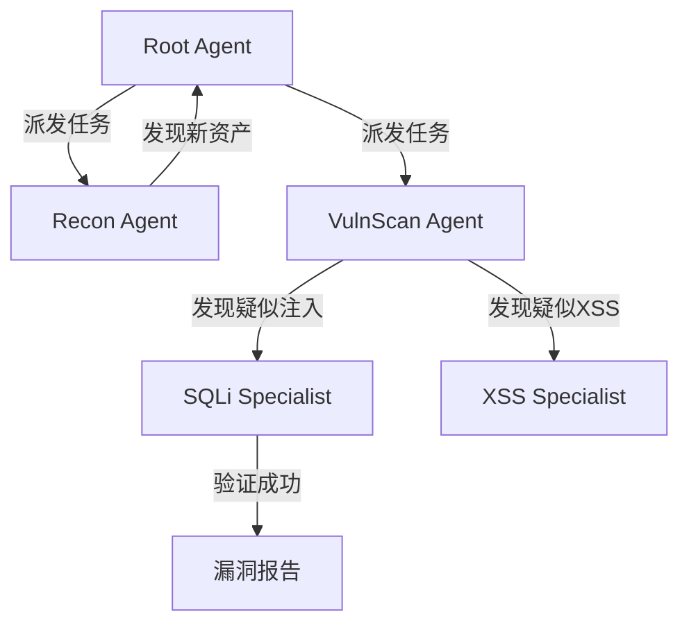

# AITest - 下一代 AI 驱动的自动化渗透测试平台

  <h3>递归式多智能体系统 | 深度逻辑推理 | 可视化攻防演练</h3>
  

    基于 <b>Go (Wails)</b> 与 <b>React</b> 构建，集成大语言模型 (LLM) 的自动化安全评估专家。
  

---

## 📖 项目简介

**AITest** 是一个突破性的自动化渗透测试平台，旨在通过**递归式多智能体 (Recursive Multi-Agent)** 架构，模拟人类安全专家的思维与操作流程。与传统扫描器不同，AITest 不仅仅是执行预定义的脚本，它具备**观察 (Observe)**、**思考 (Think)** 和 **行动 (Act)** 的能力。

系统由一个主控智能体 (Root Agent) 和多个专业领域的子智能体 (Sub-Agents) 组成。它们能够自主协作，从信息收集开始，逐步深入到漏洞发现与利用，并对发现的资产进行递归式的深度分析。

## ✨ 核心特性

- **🤖 递归式多智能体架构**
  - **Root Agent**: 负责全局统筹与战略决策。
  - **Recon Agent**: 专注于深度信息收集与资产发现。
  - **VulnScan Agent**: 自动化漏洞扫描与验证。
  - **Specialist Agents**: 针对特定领域（SQL注入、XSS、Fuzzing）的专家级智能体。
  
- **🧠 深度逻辑推理 (CoT)**
  - 基于 LLM (OpenAI 兼容接口) 的决策引擎。
  - 具备 "思维链" (Chain of Thought) 能力，能够分析复杂场景。
  - 自动根据工具输出调整测试策略，而非死板的流程执行。

- **👁️ 实时可视化交互**
  - 详细的终端日志与推理过程展示，让 AI 的每一步操作都透明可见。
  - 漏洞发现实时推送与展示。

- **🛠️ 强大的工具生态集成**
  - **扫描**: Nmap, Nuclei
  - **Web**: Curl, Ffuf (目录枚举)
  - **漏洞利用**: SQLMap (自动化注入)
  - **其它**: DNS枚举, Shell执行等

### 智能体协作流

## 🛡️ 免责声明

本工具 (**AITest**) 仅供**授权的安全测试**与**教育研究**使用。

- 请勿在未获得明确授权的目标上使用本工具。
- 开发者不对因使用本工具造成的任何直接或间接损失承担责任。
- 使用本工具即代表您同意遵守当地法律法规。

## 🤝 贡献指南

欢迎提交 Pull Request 或 Issue！我们特别关注以下领域的贡献：
- 新的专用子智能体 (如 Auth Bypass, API Testing)
- 更多安全工具的集成
- Prompt Engineering 的优化

